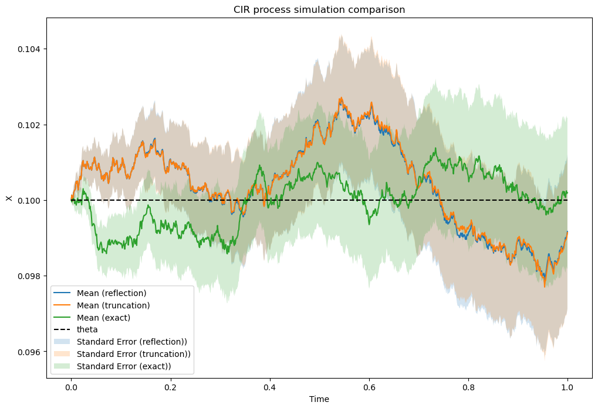

# CIR-Process

*Original project done as part of MATH-GA - 2048. All rights reserved.*

## Introduction

The **Square Root Diffusion Process** was introduced by Cox, Ingersoll, and Ross in 1985 as a model to describe interest rate behaviors. Later, it was adapted by Heston in 2015 for applications such as stochastic volatility in option pricing. The process is governed by the stochastic differential equation:

$$
d x_t = \kappa ( \theta - x_t ) dt + \sigma \sqrt{x_t} dZ_t
$$

Where:

- $x_t$: Process level at time $t$
- $\kappa$: Mean-reversion factor
- $\theta$: Long term mean of the process
- $\sigma$: Constant volatility
- $Z$: Standard Brownian motion

## Euler Discretization Scheme

Solving this stochasting differential equation gives values of $x_t$ that are distributed chi-squared. However, for simplification in simulations, it is often discretized using a normal distribution. This approximation is known as the Euler discretization scheme and is given by:

$$
x_t = x_{t-1} + \kappa ( \theta - x_{t-1} ) \delta t + \sigma \sqrt{x_{t-1} \delta t} z_t
$$

The use of a normal distribution introduces a limitation where $x_t$ can take negative values, which is not consistent with the square-root diffusion property. There are several methods to address this issue:

### 1. Truncation Method

In this approach, negative values are truncated to zero:

$$
x_t = x_{t-1} + \kappa ( \theta - x_{t-1}^+ ) \delta t + \sigma \sqrt{x_{t-1}^+ \delta t} z_t
$$

### 2. Reflection Method

Here, positive values are used as-is, while negative values are reflected by changing their sign:

$$
x_t = \left\{
\begin{array}{ll}
x_{t-1} + \kappa ( \theta - x_{t-1} ) \delta t + \sigma \sqrt{x_{t-1} \delta t} z_t & \text{if } > 0 \\
x_{t-1} + \kappa ( \theta - x_{t-1} ) \delta t - \sigma \sqrt{x_{t-1} \delta t} z_t & \text{if } < 0
\end{array}
\right.
$$

### 3. Exact Discretization

This method uses the noncentral chi-squared distribution, $\chi_d^2$, and is defined as:

$$
x_t = \frac{\sigma^2 (1-e^{-\kappa \delta t})}{4 \kappa}
\chi_d^2 \left( \frac{4 \kappa e^{-\kappa \delta t}}{\sigma^2(1-e^ {-\kappa \delta t})}x_{t-1} \right)
$$

With degrees of freedom:

$$
d = \frac{4 \theta \kappa}{\sigma^2}
$$

## Results

We implement and compare the three methods, the code provided yields to the following results:

They all work and follow closely the real mean-reverting process. However, the approximate methods if they follow closely are not identical to the exact one.

Time complexity analysis yields that both approximate approach are as fast and are 3x faster than the exact one. This is due to the fact that the exact method requires the computation of the noncentral chi-squared distribution, which is a more complex computation than the normal distribution.

Unless a very high degree of precision is required, the approximate methods are a good choice to simulate the square-root diffusion process.
